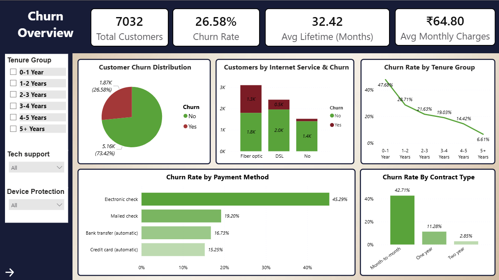
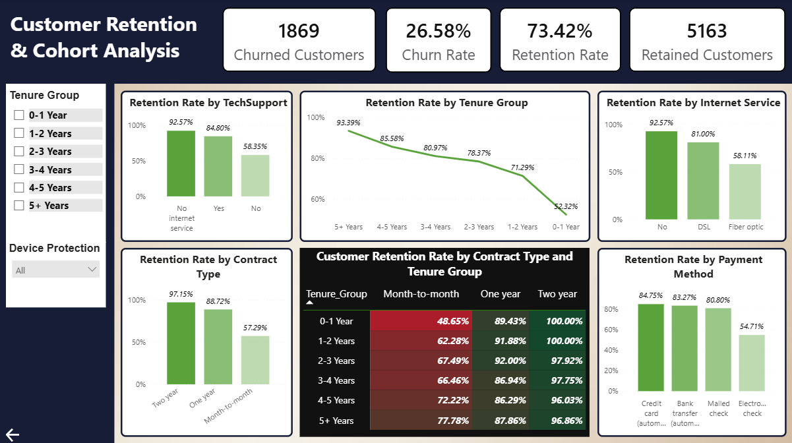

# Customer Retention & Churn Analysis

## Project Overview
This project analyzes customer churn and retention behavior for a subscription-based business using Excel, Python, and Power BI. The objective was to identify churn patterns, retention drivers, customer lifetime trends, and provide actionable business recommendations.

## Tools Used
- Microsoft Excel
- Python
- Power BI

### Python Libraries
- pandas
- matplotlib
- seaborn

## Dataset Used
Telco Customer Churn Dataset (Kaggle)

Dataset Link:  
https://www.kaggle.com/datasets/blastchar/telco-customer-churn

## Project Workflow
1. Data cleaning and preprocessing using Excel Power Query  
2. Pivot Table analysis in Excel  
3. Churn and retention analysis using Python  
4. Dashboard creation in Power BI  
5. Cohort and customer lifetime analysis  

## Dashboard Features
- Churn Overview Dashboard
- Retention & Cohort Analysis Dashboard
- Interactive KPI Cards
- Cohort Heatmap
- Customer Lifetime Analysis
- Dynamic Filters & Slicers
- Multi-page Navigation

## Key Insights
- Month-to-month customers showed the highest churn rate
- Electronic check users had higher churn behavior
- Long-term contract customers demonstrated stronger retention
- Customers with longer tenure showed higher loyalty
- Automatic payment methods improved retention performance

## Business Recommendations
- Improve onboarding for new customers
- Promote yearly and two-year contracts
- Encourage automatic payment methods
- Improve customer support services
- Launch loyalty and retention programs

## Dashboard Screenshots

### Churn Overview Dashboard

### Retention & Cohort Analysis Dashboard

## Project Outcome
This project demonstrates practical skills in:
- Data Cleaning
- Data Analysis
- Customer Analytics
- Cohort Analysis
- Power BI Dashboarding
- Business Intelligence
- Data Visualization

## Author
Sahinka Sarkar
